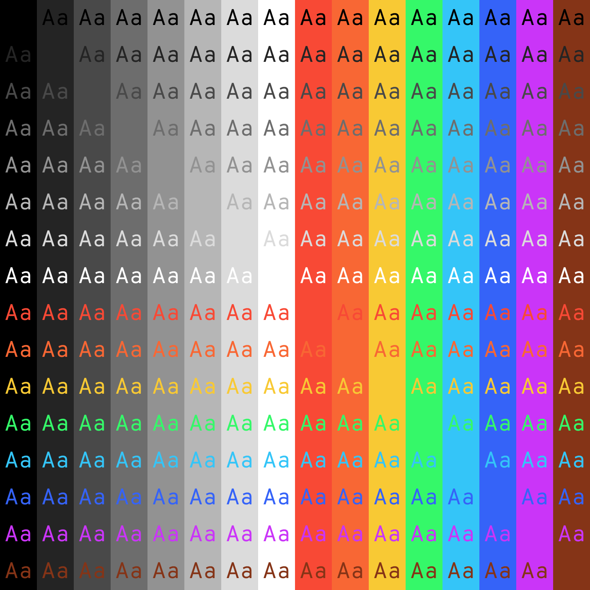

# My Color Scheme

This is based off of the [base16](https://github.com/chriskempson/base16) architecture. My goal here was to have consistently vibrant colors that are readable on black as well as white. I started out with the orange color (#F86734) because I really liked the shade. All the colors have the same saturation and brightness (except brown, which has the same hue and saturation as orange but half the brightness). The eight monochromatic colors are just evenly spaced from #000000 to #FFFFFF. I wanted pure black to be the background because it works great on AMOLED displays.

